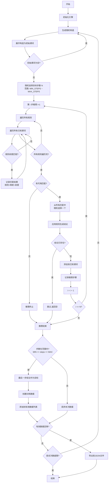
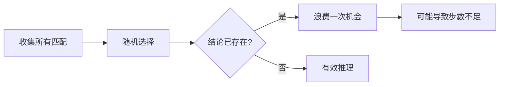
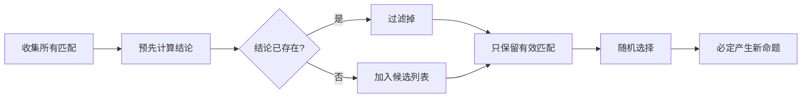

# GENERATED BY AI

## 训练数据生成逻辑流程图

## 核心逻辑说明

### 1. 初始化阶段
- 重置引擎状态（清空已知谓词、推理步骤）
- 随机选择几何构造类型（三角形、中点、外心、垂心、平行四边形等）

### 2. 展开构造
- 将构造语句展开为初始谓词
- 例如 `m = midpoint m a b` 展开为 `midp m a b`, `coll m a b`, `cong m a m b`

### 3. 逐步推理（核心）
- **收集所有可能的匹配**：遍历所有规则和已知谓词，找出所有能匹配的组合
- **随机选择一个匹配**：从所有匹配中随机选一个
- **生成新命题**：应用规则产生结论
- **去重检查**：如果结论已存在则跳过

### 4. 结果验证
- 检查实际推理步数是否在 MIN_STEPS ~ MAX_STEPS 范围内
- 符合条件则保存，否则丢弃

## 问题分析（已优化）

优化前的问题：

**优化后**：在选择匹配时预先过滤掉会产生已存在结论的匹配

**优化效果**：每次推理步骤必定产生新命题，不会浪费推理机会
