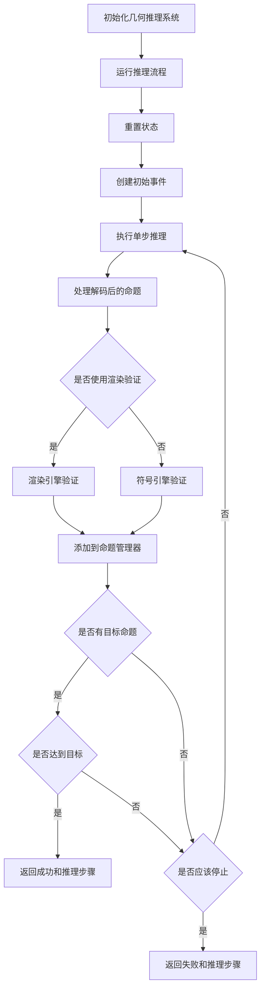

# GENERATED BY AI
# 几何推理系统工作流程

下面是几何推理系统的工作流程流程图：

## 详细流程说明

1. **初始化几何推理系统**：
   - 初始化配置
   - 初始化神经网络模型（编码器、解码器、推理AI）
   - 初始化验证引擎（渲染引擎、符号引擎、命题管理器）
   - 初始化推理状态

2. **运行推理流程**：
   - 重置状态
   - 创建初始事件（编码初始命题）
   - 将初始事件添加到事件序列
   - 执行多步推理，直到达到目标或达到最大步数

3. **单步推理**：
   - 获取事件序列的编码
   - 使用推理AI生成新的事件向量和控制信号
   - 根据控制信号决定是否使用渲染验证或解码器
   - 处理解码后的命题

4. **处理解码后的命题**：
   - 解码事件向量为命题字符串
   - 解析命题
   - 根据控制信号选择验证方式：
     - 渲染验证：使用渲染引擎验证命题
     - 符号验证：使用符号引擎验证命题
   - 将验证结果添加到命题管理器

5. **检查目标**：
   - 如果有目标命题，检查当前解码的命题是否包含目标命题的所有标记

6. **检查停止条件**：
   - 检查最近三步是否生成了相同的命题

7. **返回结果**：
   - 如果达到目标，返回成功和推理步骤
   - 如果达到最大步数或满足停止条件，返回失败和推理步骤

## 主要组件

- **编码器**：将命题编码为事件向量
- **解码器**：将事件向量解码为命题字符串
- **推理AI**：生成新的事件向量和控制信号
- **渲染引擎**：通过渲染验证命题
- **符号引擎**：通过符号验证命题
- **命题管理器**：管理命题和验证结果
- **事件序列**：存储推理过程中的事件

## 关键方法

- `encode_proposition`：编码几何命题
- `decode_event`：解码事件向量为命题字符串
- `create_initial_event`：创建初始事件
- `reasoning_step`：执行单步推理
- `_process_decoded_statement`：处理解码后的命题
- `run_reasoning`：运行完整推理流程
- `_check_target_reached`：检查是否达到目标
- `_should_stop`：检查是否应该停止推理
- `reset`：重置推理状态
- `load_models`：加载模型参数
- `save_models`：保存模型参数
- `count_parameters`：统计模型参数数量